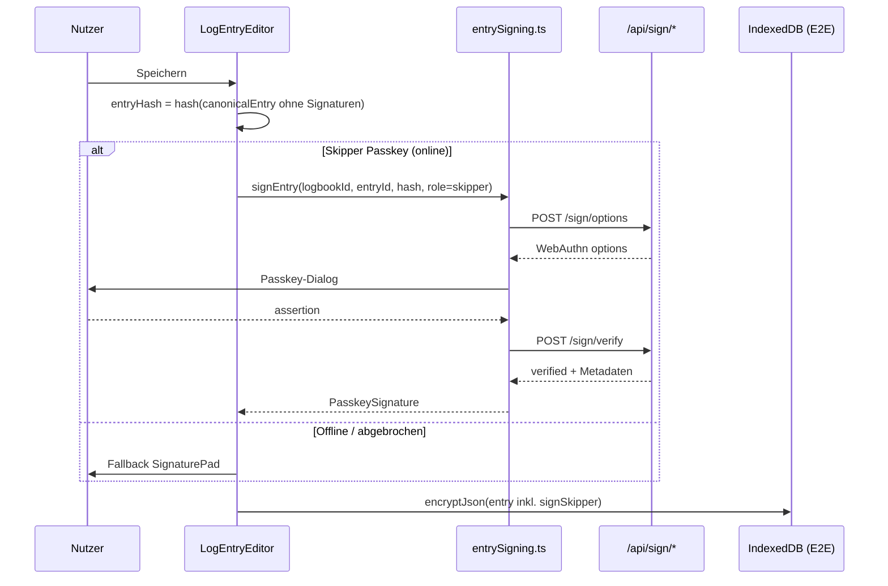

# Implementierungsvorschlag: Hybride elektronische Signatur (Variante C)

**Status:** Entwurf  
**Datum:** 2026-05-29  
**Scope:** Skipper-Freigabe per Passkey, Crew-Freigabe per Passkey *oder* klassische Unterschrift (Pad/Text)

---

## 1. Ziel

Die bestehenden Felder `signSkipper` und `signCrew` sollen um eine **identitätsgebundene Passkey-Freigabe** ergänzt werden, ohne die Papier-Tradition vollständig zu ersetzen:

| Rolle | Primär | Fallback |
|-------|--------|----------|
| **Skipper** | Passkey (WebAuthn-Assertion, an Eintrags-Hash gebunden) | SignaturePad / getippter Name (Offline, Gastgerät ohne Passkey) |
| **Crew** | Passkey (nur für eingeladene Collaborators mit WRITE) | SignaturePad / getippter Name (Gäste ohne Konto) |

**Nicht-Ziel (v1):** Qualifizierte elektronische Signatur (QES/eIDAS), serverseitiges Audit-Log (optional Phase 2), Multi-Device-Signatur-Workflow für Crew auf separatem Gerät.

---

## 2. Produktverhalten (UX)

### 2.1 Skipper-Bereich

```
┌─────────────────────────────────────────────┐
│ Skipper-Freigabe                            │
│ ┌─────────────────────────────────────────┐ │
│ │ ✓ Signiert von max@see  29.05.26 14:32 │ │  ← Passkey-Signatur vorhanden
│ │   [Erneut freigeben]  [Klassisch …]    │ │
│ └─────────────────────────────────────────┘ │
└─────────────────────────────────────────────┘
```

**Standard-Flow beim Speichern:**

1. Nutzer füllt Logbuchseite aus und tippt auf „Speichern“.
2. Wenn `signSkipper` leer ist und Netzwerk verfügbar → **Passkey-Dialog** (User Verification).
3. Nach erfolgreicher Assertion wird der Eintrag verschlüsselt gespeichert.
4. Wenn Offline oder Passkey fehlschlägt → Dialog: *„Offline / Passkey nicht verfügbar — klassische Unterschrift verwenden?“* → SignaturePad.

**Regeln:**

- Passkey-Skipper-Signatur ist an den **Eintragsinhalt ohne Signaturfelder** gebunden. Änderungen an Datum, Route, Tankständen etc. **invalidieren** die Signatur (Badge „Signatur ungültig — erneut freigeben“).
- Der Logbuch-**Owner** oder ein Collaborator mit **WRITE** darf Skipper-Freigabe leisten (konfigurierbar: v1 = jeder WRITE-Nutzer auf dem Gerät).
- Bereits signierte Einträge im **readOnly**-Modus: nur Anzeige, kein erneutes Signieren.

### 2.2 Crew-Bereich

```
┌─────────────────────────────────────────────┐
│ Crew-Freigabe                               │
│ ○ Passkey (empfohlen)   ○ Klassisch         │  ← Toggle nur wenn Collaborators existieren
│ [Mit Passkey freigeben]                     │
│ — oder —                                    │
│ [SignaturePad wie bisher]                   │
└─────────────────────────────────────────────┘
```

**Crew-Passkey:**

- Button „Mit Passkey freigeben“ startet WebAuthn mit `allowCredentials` **nur für Collaborators dieses Logbuchs** (Server liefert Credential-IDs).
- Auf einem gemeinsamen Tablet kann die Crew-Mitperson ihren Passkey wählen, ohne das Kapitäns-Konto zu verlassen.
- Ohne Collaborators: nur SignaturePad (wie heute).

**Crew ohne Konto:** unverändert Pad oder Text — kein Passkey-Zwang.

### 2.3 Zusammenfassung der Flows



---

## 3. Datenmodell

### 3.1 Neue Typen (`client/src/types/signatures.ts`)

```typescript
/** Passkey-Freigabe v1 — rein in E2E-Payload, kein Klartext auf dem Server */
export interface PasskeySignature {
  kind: 'passkey'
  version: 1
  role: 'skipper' | 'crew'
  userId: string
  username: string
  credentialId: string        // base64url
  signedAt: string            // ISO-8601 UTC
  entryHash: string           // base64url SHA-256
  /** Client-seitig gespeichert für Offline-Anzeige; Server verifiziert bei Erstellung */
  clientVerified: boolean
}

/** Legacy: string = PNG data URL oder getippter Name */
export type SignatureValue = string | PasskeySignature

export interface LogEntrySignatures {
  signSkipper?: SignatureValue
  signCrew?: SignatureValue
}
```

### 3.2 Abwärtskompatibilität

Bestehende Einträge speichern `signSkipper`/`signCrew` als `string`. Keine Migration nötig.

Hilfsfunktionen in `client/src/utils/signatures.ts` erweitern:

```typescript
export function isPasskeySignature(v: unknown): v is PasskeySignature
export function normalizeSignature(v: unknown): SignatureValue | undefined
export function formatSignatureForExport(v: SignatureValue | undefined, labels: ExportLabels): string
export function isSignatureValidForEntry(sig: PasskeySignature, entryHash: string): boolean
```

**Export-Texte (i18n):**

| Key | DE | EN |
|-----|----|----|
| `logs.sign_passkey_export` | `Passkey: {{username}} ({{date}})` | `Passkey: {{username}} ({{date}})` |
| `logs.sign_invalid` | Signatur ungültig | Signature invalid |
| `logs.sign_with_passkey` | Mit Passkey freigeben | Sign with Passkey |
| `logs.sign_classic_fallback` | Klassische Unterschrift | Classic signature |
| `logs.sign_offline_hint` | Passkey-Freigabe erfordert Internet | Passkey signing requires internet |

### 3.3 Kanonischer Eintrags-Hash

Neue Datei: `client/src/utils/entryCanonicalHash.ts`

```typescript
const SIGNATURE_KEYS = ['signSkipper', 'signCrew'] as const

/** Stabil sortiertes JSON → SHA-256 → base64url */
export async function hashEntryForSigning(entry: Record<string, unknown>): Promise<string>
```

**In Hash einbeziehen:** alle Felder außer `signSkipper`, `signCrew` und transienten UI-Feldern.  
**Reihenfolge:** Keys alphabetisch sortieren, Arrays in definierter Reihenfolge (events nach `time`), Zahlen normalisiert.

Beim Laden eines Eintrags: `computedHash !== sig.entryHash` → UI-Warnung.

---

## 4. Server-API

Neuer Router: `server/src/routes/sign.ts` → Mount unter `/api/sign`

Auth wie bestehend: Header `X-User-Id` (siehe `sync.ts`).

### 4.1 `POST /api/sign/options`

**Request:**

```json
{
  "logbookId": "uuid",
  "entryId": "uuid",
  "entryHash": "base64url-sha256",
  "role": "skipper" | "crew"
}
```

**Autorisierung:**

- Nutzer ist Owner **oder** Collaborator mit WRITE auf `logbookId`.
- Für `role: "crew"`: optional prüfen, dass mindestens ein anderer Collaborator existiert (Skipper darf auch Crew signieren in v1).

**Challenge-Konstruktion:**

```typescript
const payload = `${entryId}:${entryHash}:${role}:${randomNonce}`
const challenge = base64url(sha256(payload))
```

In-Memory-Store (analog `activeChallenges` in `auth.ts`):

```typescript
signingChallenges.set(challenge, {
  userId, logbookId, entryId, entryHash, role, expiresAt
})
```

**Response:** WebAuthn `PublicKeyCredentialRequestOptions`

- `allowCredentials`: Credentials des **anfragenden** Users (Skipper) **oder** bei `role: crew` alle Credentials der Logbook-Collaborators (Query über `Collaboration` + `Credential`).
- **Kein PRF-Extension** — reine User-Verifikation, nicht Key-Derivation.
- `userVerification: 'required'`

### 4.2 `POST /api/sign/verify`

**Request:**

```json
{
  "credentialResponse": { /* WebAuthn */ },
  "challenge": "...",
  "logbookId": "...",
  "entryId": "...",
  "entryHash": "...",
  "role": "skipper" | "crew"
}
```

**Verifikation:**

1. Challenge aus Store (TTL 5 Min, one-time).
2. `entryHash` und Metadaten müssen mit gespeichertem Kontext übereinstimmen.
3. `verifyAuthenticationResponse` wie in `auth.ts` `/login-verify`.
4. Credential-User muss berechtigt sein (Owner/Collaborator WRITE; bei Crew-Signatur: Credential gehört zu einem Collaborator des Logbuchs).

**Response:**

```json
{
  "verified": true,
  "userId": "...",
  "username": "...",
  "credentialId": "...",
  "signedAt": "2026-05-29T12:00:00.000Z"
}
```

**Wichtig:** Server speichert in v1 **keinen** Eintragsinhalt und keine Assertion — nur verifiziert und gibt Metadaten zurück. Der Client packt `PasskeySignature` ins E2E-Blob.

### 4.3 Optional Phase 2: Audit-Tabelle

```prisma
model EntrySignatureAudit {
  id           String   @id @default(uuid())
  logbookId    String
  entryId      String
  userId       String
  role         String   // skipper | crew
  entryHash    String
  credentialId String
  signedAt     DateTime @default(now())

  @@index([logbookId, entryId])
}
```

Ermöglicht spätere Prüfung ohne Entschlüsselung des Eintrags. Bewusst **ohne** Klartext-Inhalt.

---

## 5. Client-Implementierung

### 5.1 Neuer Service: `client/src/services/entrySigning.ts`

```typescript
export async function signLogEntry(params: {
  logbookId: string
  entryId: string
  entryHash: string
  role: 'skipper' | 'crew'
}): Promise<PasskeySignature>

export async function listCollaboratorCredentialIds(logbookId: string): Promise<string[]>
// Wrapper für /api/sign/options + startAuthentication + /api/sign/verify
// Kein PRF — separates Flow von loginUser()
```

Wiederverwendung: `@simplewebauthn/browser` `startAuthentication`, Muster aus `auth.ts` (Retry ohne PRF entfällt hier).

### 5.2 UI-Komponenten

| Datei | Aufgabe |
|-------|---------|
| `client/src/components/SignatureSection.tsx` | Container für Skipper + Crew, Modus-Toggle |
| `client/src/components/PasskeySignButton.tsx` | Button, Loading, Fehler, Erfolgs-Badge |
| `client/src/components/SignaturePad.tsx` | unverändert für Fallback |

**`LogEntryEditor.tsx` Änderungen:**

- State: `signSkipper: SignatureValue | ''`, `signCrew: SignatureValue | ''`
- Beim Submit: zuerst `entryData` ohne Signaturen hashen, dann Skipper-Passkey anstoßen (wenn gewählt/leer+online).
- `readOnly`: Passkey-Badge + „Signiert von … am …“; Pad disabled.

**`LogEntriesList.tsx`:** Default für neue Einträge `signSkipper: undefined` (nicht leerer String erzwingen).

### 5.3 Speichern-Logik (Pseudocode)

```typescript
async function handleSubmit() {
  const entryData = buildEntryPayload({ signSkipper: undefined, signCrew: undefined })
  const entryHash = await hashEntryForSigning(entryData)

  let skipperSig = signSkipper
  if (skipperSignMode === 'passkey' && !isPasskeySignature(skipperSig)) {
    skipperSig = await signLogEntry({ logbookId, entryId, entryHash, role: 'skipper' })
  }

  const finalEntry = { ...entryData, signSkipper: skipperSig, signCrew: signCrew }
  await encryptAndSave(finalEntry)
}
```

Crew-Passkey: separater Button (nicht zwingend beim Speichern), damit Crew-Mitglied nach dem Skipper signieren kann.

### 5.4 Export-Anpassungen

**CSV** (`csvExport.ts`):

```typescript
formatSignatureForExport(value, {
  imagePlaceholder: t('logs.sign_export_image'),
  passkeyTemplate: (sig) => i18n.t('logs.sign_passkey_export', { username: sig.username, date: format(sig.signedAt) })
})
```

**PDF** (`pdfExport.ts`):

- Passkey: zweizeilig — `SIGNIERT / SIGNED` + Username + Datum (kein Bild).
- Bild/Text: bestehende Logik.

---

## 6. Offline-Verhalten

| Situation | Verhalten |
|-----------|-----------|
| Online + Passkey | Standard Skipper-Flow |
| Offline | Passkey deaktiviert; Hinweis + SignaturePad |
| Eintrag offline gespeichert, später online | Kein Auto-Nachsignieren; Nutzer tippt „Mit Passkey freigeben“ |
| Passkey-Signatur vorhanden, Inhalt geändert | Signatur als ungültig markieren, erneute Freigabe nötig |

Kein Offline-Queue für WebAuthn in v1 — zu komplex (Challenge-Ablauf, Counter-Sync).

---

## 7. Sicherheit

| Risiko | Mitigation |
|--------|------------|
| Signatur ohne Inhaltsbindung | `entryHash` in Challenge + im `PasskeySignature`-Objekt |
| Fremder signiert Skipper-Feld | Server prüft WRITE auf Logbook + Credential-Zugehörigkeit |
| Replay der Assertion | Challenge one-time, 5 Min TTL |
| Manipulation nach Signatur | Client prüft Hash bei Anzeige; Export zeigt „invalid“ |
| E2E vs. Audit | v1 nur E2E-Metadaten; Audit optional Phase 2 |
| Login-Session vs. Signatur | Separater Endpoint, `userVerification: required`, kein PRF |

**Hinweis:** Gespeicherte `PasskeySignature` im E2E-Blob ist **selbst nicht kryptografisch signiert** durch den Server (Server sieht Payload nicht). Vertrauen basiert auf: (a) erfolgreiche Server-Verifikation zum Zeitpunkt der Erstellung, (b) Hash-Bindung, (c) optional Audit-Log in Phase 2. Für stärkere Non-Repudiation: Assertion-Response oder Server-Signatur über Hash in Audit speichern.

---

## 8. Implementierungsphasen

### Phase 1 — Fundament (MVP)

**Ziel:** Skipper Passkey + Crew Pad, Hash, Export, Fallback.

| # | Task | Dateien |
|---|------|---------|
| 1.1 | Typen + Signature-Utils | `types/signatures.ts`, `utils/signatures.ts`, `utils/entryCanonicalHash.ts` |
| 1.2 | Server `/api/sign/*` | `server/src/routes/sign.ts`, `server/src/index.ts` (mount) |
| 1.3 | Client `entrySigning.ts` | `client/src/services/entrySigning.ts` |
| 1.4 | UI Skipper Passkey + Pad-Fallback | `PasskeySignButton.tsx`, `SignatureSection.tsx`, `LogEntryEditor.tsx` |
| 1.5 | Crew nur Pad (unverändert) | `SignatureSection.tsx` |
| 1.6 | Export CSV/PDF | `csvExport.ts`, `pdfExport.ts` |
| 1.7 | i18n DE/EN | `locales/de.json`, `locales/en.json` |

**Akzeptanzkriterien:**

1. Skipper kann Eintrag online per Passkey freigeben; PDF/CSV zeigen Username + Datum.
2. Offline → Pad-Fallback funktioniert.
3. Alte Einträge (String-Signaturen) laden und exportieren unverändert.
4. Geänderte Felder nach Passkey-Signatur → Warnung „Signatur ungültig“.

### Phase 2 — Crew Passkey

| # | Task | Dateien |
|---|------|---------|
| 2.1 | Collaborator-Credentials in `/sign/options` | `sign.ts`, ggf. `collaboration.ts` |
| 2.2 | Crew-Toggle Passkey vs. Pad | `SignatureSection.tsx` |
| 2.3 | Collaborator-Liste für UI | `SettingsForm` / neuer Hook `useLogbookCollaborators` |

**Akzeptanzkriterien:**

1. Eingeladener WRITE-Collaborator kann Crew-Feld per eigenem Passkey signieren.
2. Gäste ohne Konto nutzen weiterhin Pad.

### Phase 3 — Härtung (optional)

- Prisma `EntrySignatureAudit`
- „Signatur prüfen“-Button (Re-Verify gegen Server, wenn online)
- Einstellung im Logbook: „Skipper-Freigabe nur Passkey“ (Pad-Fallback deaktivieren)
- Tests: Unit-Tests für `hashEntryForSigning`, Integrationstest `/sign/verify`

---

## 9. Testplan

### Manuell

- [ ] DE/EN: Export-Texte für Passkey, Pad, leer
- [ ] Skipper Passkey → Speichern → Reload → Badge sichtbar
- [ ] Eintrag ändern → ungültige Signatur
- [ ] Offline speichern mit Pad
- [ ] Legacy-Eintrag mit PNG-Signatur lädt korrekt
- [ ] Crew-Collaborator Passkey auf zweitem Account
- [ ] READ-only Collaborator darf nicht signieren (403)

### Automatisiert (empfohlen)

```typescript
// entryCanonicalHash.test.ts
test('stable hash ignores signature fields')
test('different tank values produce different hash')

// signatures.test.ts
test('formatSignatureForExport passkey vs image vs text')
test('isSignatureValidForEntry')
```

---

## 10. Aufwandsschätzung

| Phase | Aufwand |
|-------|---------|
| Phase 1 (MVP) | ~2–3 Tage |
| Phase 2 (Crew Passkey) | ~1 Tag |
| Phase 3 (Audit + Tests) | ~1–2 Tage |

---

## 11. Offene Entscheidungen (vor Implementierung klären)

1. **Skipper-Pflicht:** Muss jeder Eintrag Passkey-signiert sein, oder optional wie heute?
   - *Empfehlung v1:* Optional; Passkey wird beim Speichern **angeboten**, Pad bei Offline.

2. **Wer darf Skipper signieren?** Nur Owner oder jeder WRITE-Nutzer?
   - *Empfehlung v1:* Jeder WRITE-Nutzer (typisch: Kapitän auf eigenem Gerät).

3. **Pad-Fallback dauerhaft erlauben?**
   - *Empfehlung:* Ja (Variante C); später Logbook-Setting zum Erzwingen von Passkey.

4. **Crew-Passkey beim Speichern oder separater Schritt?**
   - *Empfehlung:* Separater Button — Crew signiert oft nach dem Skipper.

---

## 12. Referenzen im Code

| Bereich | Pfad |
|---------|------|
| Aktuelle Signaturen | `client/src/components/LogEntryEditor.tsx` (ca. Z. 611–612, 1312–1336) |
| Signature-Utils | `client/src/utils/signatures.ts` |
| WebAuthn Login | `client/src/services/auth.ts`, `server/src/routes/auth.ts` |
| Collaborators | `server/src/routes/collaboration.ts`, `SettingsForm.tsx` |
| E2E-Einträge | `EntryPayload` in `server/prisma/schema.prisma` |
| Auth-Header | `X-User-Id` in `server/src/routes/sync.ts` |

---

*Entwurf für Variante C — Hybrid elektronische Signatur im Kapteins Daagbok.*
