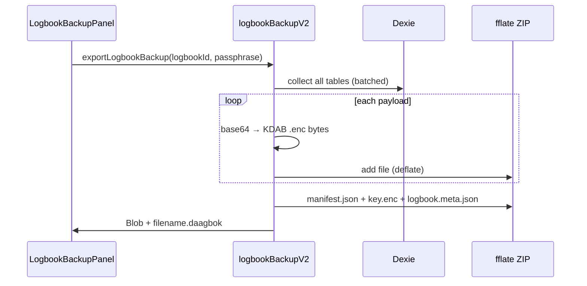

# Backup-Format v2 — Design

**Status:** Implementiert in `feature/backup-format-v2` (`BACKUP_VERSION = 2`, Datei `*.daagbok`).

**Ziel:** Logbuch-Backups skalieren für viele Reisetage, Fotos, Voice-Memos und GPS-Tracks — ohne den gesamten Inhalt als eine große JSON-Datei im Browser-RAM zu halten.

**Ausgangslage:** v1 (`BACKUP_VERSION = 1`, Datei `*.daagbok.json`) serialisiert alle Payloads in ein einziges JSON-Objekt mit Pretty-Print. Binärdaten stecken doppelt als Base64-Strings in `encryptedData`. Import nutzt `file.text()` + `JSON.parse()` auf der vollen Datei.

**Entscheidung:** Keine Abwärtskompatibilität zu v1 — es gibt noch keine produktiven User-Backups. v1-Code und `-json`-Dateiendung wurden durch v2 ersetzt.

---

## 1. Anforderungen

### Funktional

| ID | Anforderung |
|----|-------------|
| B-01 | Export enthält **alle** lokalen Logbuch-Payloads: yacht, deviation, crews, entries, photos, voiceMemos, gpsTracks, **logbookCrewSelection**, **logbookVesselSelection**, **nmeaArchives**. |
| B-02 | E2E-Verschlüsselung bleibt: Logbuch-Key mit Backup-Passphrase (PBKDF2) gewrappt; Payload-Blobs unverändert wie in Dexie (AES-GCM über `encryptJson`). |
| B-03 | Medien (Fotos, Voice-Memos) als **binäre Blob-Dateien** im Archiv, nicht als Base64 in JSON. |
| B-04 | Strukturdaten (Manifest, kleine Metadaten) als **kompaktes JSON** (ein Zeile, kein Pretty-Print). |
| B-05 | Gesamtarchiv **DEFLATE-komprimiert** (ZIP). |
| B-06 | Preview (Titel, Counts, Export-Datum) ohne vollständiges Entpacken aller Medien — nur Manifest + Key-Entschlüsselung. |
| B-07 | Restore-Optionen wie heute: `overwrite`, `assignNewId`, Konflikt bei gleicher ID. |
| B-08 | Nach Restore: Sync-Queue wie heute befüllen, optional `syncLogbook` wenn online. |
| B-09 | Export vor Download optional mit **Fortschrittsanzeige** (Anzahl Blobs / Bytes). |

### Nicht-Ziele (v2)

- Inkrementelles / dedupliziertes Backup über mehrere Dateien.
- Backup auf dem Server (nur lokaler Download wie heute).
- Klartext-Manifest oder unverschlüsselte Medien.
- Account-weites Multi-Logbuch-Archiv (weiterhin **ein Logbuch pro Datei**).

### Akzeptanzkriterien (UAT)

1. Logbuch mit 50 Fotos + 20 Voice-Memos exportieren → Datei `.daagbok` deutlich kleiner als vergleichbares v1-JSON (Kompression + kein Pretty-Print + binäre Blobs).
2. Restore auf frischem Gerät (eingeloggt) → alle Einträge, Medien abspielbar, Crew/Vessel-Selection vorhanden.
3. Falsches Passphrase → `BACKUP_WRONG_PASSPHRASE` (wie heute).
4. Beschädigtes ZIP / fehlende Manifest → `BACKUP_INVALID_FORMAT`.
5. v1-Datei (`version: 1`) → `BACKUP_VERSION_UNSUPPORTED` mit Hinweis.

---

## 2. Container: ZIP-Archiv

| Eigenschaft | Wert |
|-------------|------|
| MIME-Typ (Download) | `application/vnd.kapteins-daagbok+zip` (Fallback: `application/zip`) |
| Dateiendung | `.daagbok` (kein `.json`) |
| Kompression | ZIP mit DEFLATE (Level 6 — Balance Größe/Geschwindigkeit) |
| Magic / Erkennung | ZIP-Signatur `PK\x03\x04` + `manifest.json` mit `format` + `version: 2` |

**Bibliothek (Client):** [`fflate`](https://github.com/101arrowz/fflate) (klein, ESM, ZIP sync/async). Als direkte `dependencies`-Eintrag in `client/package.json`, nicht nur transitiv.

**Warum ZIP und nicht nur gzip auf einer JSON-Datei?**

- Viele unabhängige Blobs → paralleles Entpacken, Preview ohne alle Medien zu lesen.
- Manifest bleibt klein (< 100 KB typisch).
- Standard-Tooling (optional manuelle Inspektion mit `unzip -l`).

---

## 3. Archiv-Layout

```
backup.daagbok (ZIP)
├── manifest.json          # Klartext-Metadaten + Index (kompakt)
├── key.enc                # Mit Backup-Passphrase gewrapptes Logbuch-Key (binär)
├── logbook.meta.json      # encryptedTitle, id, updatedAt, isDemo (klein, JSON)
└── payloads/
    ├── yacht.enc
    ├── deviation.enc
    ├── logbook-crew.enc
    ├── logbook-vessel.enc
    ├── crews/
    │   └── {payloadId}.enc
    ├── entries/
    │   └── {payloadId}.enc
    ├── photos/
    │   └── {payloadId}.enc      # + sidecar optional: {payloadId}.meta.json
    ├── voice-memos/
    │   └── {payloadId}.enc
    ├── gps-tracks/
    │   └── {entryId}.enc
    └── nmea-archives/
        └── {entryId}.enc
```

### 3.1 `manifest.json` (Schema)

```json
{
  "format": "kapteins-daagbok-backup",
  "version": 2,
  "exportedAt": "2026-06-03T12:00:00.000Z",
  "appVersion": "0.1.0.109",
  "compression": "zip-deflate-6",
  "logbookId": "uuid",
  "counts": {
    "entries": 42,
    "photos": 50,
    "voiceMemos": 12,
    "crews": 3,
    "gpsTracks": 40,
    "nmeaArchives": 2,
    "hasYacht": true,
    "hasDeviation": true,
    "hasLogbookCrewSelection": true,
    "hasLogbookVesselSelection": true
  },
  "totalUncompressedBytes": 125000000,
  "files": {
    "key": "key.enc",
    "logbook": "logbook.meta.json",
    "yacht": "payloads/yacht.enc",
    "deviation": null,
    "logbookCrewSelection": "payloads/logbook-crew.enc",
    "logbookVesselSelection": "payloads/logbook-vessel.enc",
    "crews": [
      { "payloadId": "…", "path": "payloads/crews/….enc", "updatedAt": "…" }
    ],
    "entries": [ … ],
    "photos": [
      { "payloadId": "…", "entryId": "…", "path": "…", "updatedAt": "…", "bytes": 183422 }
    ],
    "voiceMemos": [ … ],
    "gpsTracks": [ … ],
    "nmeaArchives": [ … ]
  }
}
```

- **`appVersion`:** optional, aus Client-Build (PWA-Version) — nur für Support/Debug.
- **`totalUncompressedBytes`:** Summe der Blob-Größen vor ZIP — für UI („~120 MB“) und Speicher-Warnung vor Import.
- **Keine** `encryptedData` / IV / Tag im Manifest für große Blobs — nur im Binärformat (siehe 3.2).

### 3.2 Binärformat `.enc` (einheitlich für alle Payloads)

Jede `.enc`-Datei ist **roh**, kein JSON:

```
Offset  Size     Inhalt
0       4        Magic ASCII "KDAB" (Kaptein's Daagbok)
4       1        Format version = 1
5       12       IV (AES-GCM, wie heute)
17      16       Auth tag (AES-GCM)
33      N        Ciphertext (identisch mit heutigem decryptJson-Eingang:
                  Base64-decode von encryptedData + concat mit tag in decryptBuffer)
```

**Migration von Dexie:** Beim Export aus `encryptedData` (Base64-String) + `iv` + `tag` (Base64) → einmal decodieren → `.enc`-Datei schreiben. Beim Import umgekehrt → Dexie-Felder wie heute.

Vorteil: ~33 % weniger Speicher als Base64-in-JSON; Parser liest nur Header + Länge.

**`key.enc`:** Gleiches Binärformat, Inhalt = `encryptBuffer(logbookKey, passphraseDerivedKey)` — ersetzt das JSON-Objekt `logbookKey: { ciphertext, iv, tag }` aus v1.

**`logbook.meta.json`:** Unverändert kleines JSON (nur `encryptedTitle`, `updatedAt`, `isDemo`) — kein Binärbedarf.

### 3.3 Optionale Sidecars (Phase 2, nicht blocking v2)

Für Photos/Voice-Memos könnte `{id}.meta.json` nur `{ entryId, updatedAt }` enthalten, falls das Manifest zu groß wird (>10k Medien). v2 startet mit **allen Metadaten im Manifest** — ausreichend bis ~einige tausend Dateien.

---

## 4. Kryptographie (unverändert in der Semantik)

| Element | v1 | v2 |
|---------|----|----|
| Logbuch-Key im Backup | PBKDF2 + AES-GCM (`KapteinsDaagbokBackupFileSalt_v1`) | **Gleich** (Salt-String beibehalten für gleiche Passphrase → gleicher Key) |
| Payload-Verschlüsselung | `encryptJson` mit Logbuch-Key | **Byte-für-byte gleicher Ciphertext** in `.enc` |
| Passphrase-Mindestlänge | 8 Zeichen | 8 Zeichen |

Optional in v2.1 (nicht v2): PBKDF2-Iterationen erhöhen (z. B. 310_000) mit neuem Salt `…_v2` und Feld `keyWrap: "pbkdf2-v2"` in Manifest — nur wenn gewünscht.

---

## 5. Ablauf Export



### Implementierungsdetails

1. **Pre-sync:** wie heute `syncLogbook(logbookId)` wenn online.
2. **Sammlung:** `collectLogbookPayloadsV2()` — alle Tabellen aus Abschnitt B-01; Batches à 20 für Medien.
3. **ZIP-Erzeugung:** `fflate` `zipSync` oder `zip` mit Streaming-Callback; **nicht** das gesamte Archiv als ein Array im RAM, wenn `totalUncompressedBytes > 80_000_000` → Warnung in UI + ggf. `requestIdleCallback` zwischen Blobs.
4. **Fortschritt:** `onProgress({ phase, current, total, bytes })`.
5. **Download:** `downloadBackupBlob(blob, `${safeTitle}-${date}.daagbok`)`.

### Speicher-Richtwerte (UI-Warnung)

| Uncompressed | Empfehlung |
|--------------|------------|
| < 50 MB | Normal exportieren |
| 50–150 MB | Hinweis: Import kann auf schwachen Geräten dauern |
| > 150 MB | Bestätigungsdialog; Export trotzdem erlauben |

ZIP reduziert typisch Medien-Anteil um **20–40 %** (JPEG/WebM komprimieren schlecht in ZIP, aber Base64-Overhead entfällt).

---

## 6. Ablauf Import / Preview

### Preview (Passphrase-Check)

1. ZIP öffnen (nur zentrales Directory lesen — `fflate` `unzip`).
2. `manifest.json` parsen → `version === 2` prüfen.
3. `key.enc` laden → Passphrase → Logbuch-Key.
4. `logbook.meta.json` → Titel entschlüsseln.
5. Counts aus Manifest anzeigen — **keine** Medien-Blobs dekodieren.

### Restore

1. Vollständig entpacken in **temporäre Struktur** (Object-URLs / `Map<path, Uint8Array>`) — bei >150 MB Warnung.
2. `writeBackupToDexieV2()` — analog v1, aber aus `.enc` Bytes.
3. `queueRestoredLogbookForSync()` — unveränderte Sync-Queue-Semantik.
4. `listCache` auf Entries: nach Restore optional aus Entry-Payload neu ableiten (wie bei normalem Decrypt) oder beim Export mit speichern — **Design:** listCache beim Export **nicht** sichern (bleibt abgeleitetes Feld); nach Restore beim ersten Öffnen neu berechnen.

### Fehlercodes (neu/angepasst)

| Code | Bedeutung |
|------|-----------|
| `BACKUP_VERSION_UNSUPPORTED` | `version !== 2` (inkl. v1) |
| `BACKUP_INVALID_ARCHIVE` | Kein ZIP / kein manifest |
| `BACKUP_MISSING_BLOB` | Index verweist auf fehlende Datei |
| `BACKUP_INVALID_ENC` | Magic/ Länge ungültig |
| *(bestehend)* | `BACKUP_WRONG_PASSPHRASE`, `BACKUP_ID_CONFLICT`, … |

---

## 7. Code-Struktur (Implementierung)

| Datei | Aufgabe |
|-------|---------|
| [`client/src/services/logbookBackup/encBlob.ts`](client/src/services/logbookBackup/encBlob.ts) | `dexieRecordToEncBytes`, `encBytesToDexieFields` |
| [`client/src/services/logbookBackup/manifest.ts`](client/src/services/logbookBackup/manifest.ts) | Typen `BackupManifestV2`, Validierung |
| [`client/src/services/logbookBackup/zipArchive.ts`](client/src/services/logbookBackup/zipArchive.ts) | ZIP pack/unpack mit fflate |
| [`client/src/services/logbookBackup.ts`](client/src/services/logbookBackup.ts) | Öffentliche API: `exportLogbookBackup`, `parseLogbookBackupFile`, `preview…`, `restore…` — ruft v2 intern auf |
| [`client/src/components/LogbookBackupPanel.tsx`](client/src/components/LogbookBackupPanel.tsx) | `.daagbok`-Accept, Fortschrittsbalken, Größen-Warnung |
| i18n `settings.backup_*` | Texte für v2, `BACKUP_VERSION_UNSUPPORTED` |
| [`docs/plausible-events.md`](docs/plausible-events.md) | Properties `bytes`, `counts` bei Export/Restore |

**v1 entfernen:** `BACKUP_VERSION = 1`, `LogbookBackupFile`-Monolith, `JSON.stringify(…, null, 2)`, `normalizeBackupPayloads` für voiceMemos — löschen, nicht parallel halten.

---

## 8. Vergleich v1 → v2

| Aspekt | v1 | v2 |
|--------|----|----|
| Container | Eine JSON-Datei | ZIP `.daagbok` |
| Medien im Export | Base64 in JSON-Strings | Binäre `.enc`-Dateien |
| Manifest | Alles in einem Objekt | Schlankes `manifest.json` + Blobs |
| Kompression | Keine (+ Pretty-Print) | DEFLATE |
| RAM Import | `file.text()` + full parse | ZIP directory + gezieltes Entpacken; Preview nur Manifest |
| Fehlende Payloads | Kein crew/vessel selection, kein NMEA | Vollständig |
| Abwärtskompatibel | — | Nein (bewusst) |

### Größenbeispiel (Schätzung)

100 Fotos à ~250 KB verschlüsselt (≈190 KB Ciphertext):

- **v1 JSON:** ~100 × (190 KB × 4/3 Base64) ≈ **25 MB** nur Fotos-Ciphertext-Strings + JSON-Escaping + Pretty-Print → oft **35+ MB**
- **v2 ZIP:** ~100 × 190 KB + Kompression ≈ **19–22 MB** Archiv

---

## 9. Implementierungsplan (Phasen)

### Phase 1 — Kern (MVP v2)

- [x] `encBlob` + `manifest` + `zipArchive` Module
- [x] Export/Import/Preview/Restore auf v2
- [x] Alle Dexie-Tabellen inkl. crew/vessel selection + nmeaArchives
- [x] UI: `.daagbok`, Fehler `BACKUP_VERSION_UNSUPPORTED` für v1-JSON
- [x] Tests: `encBlob` unit tests

### Phase 2 — UX & Robustheit

- [x] Export-Fortschritt
- [x] Größen-Warnung vor Import (>150 MB)
- [ ] `onProgress` während Restore

### Phase 3 — Optional

- [ ] Streaming-Export für sehr große Archive (fflate async + Chunk-Schreiben)
- [ ] PBKDF2 v2 mit höheren Iterationen
- [ ] Sidecar-Metadaten wenn Manifest > 2 MB

---

## 10. Testplan

| Test | Typ |
|------|-----|
| `encBlob`: round-trip Dexie-Felder ↔ Bytes | Unit |
| Manifest-Validator: version 2, fehlende paths | Unit |
| Export → unzip → Manifest-Counts = DB-Counts | Integration (Vitest + IndexedDB fake) |
| Restore → decrypt photo/voice → gültige Data-URL | Integration |
| v1-JSON-Datei → `BACKUP_VERSION_UNSUPPORTED` | Unit |
| Korruptes ZIP → `BACKUP_INVALID_ARCHIVE` | Unit |

---

## 11. Dokumentation & Analytics

- Nutzer-Texte: „Sicherungsdatei `.daagbok`“ statt `.daagbok.json`.
- Plausible **Backup Exported / Restored:** Properties `bytes`, `photos`, `voiceMemos` (Anzahlen, keine Inhalte).
- Deployment: **kein Server-Change** — Backup ist rein clientseitig.

---

## 12. Offene Punkte (für Review)

1. **Schwellwert Speicher-Warnung:** 150 MB uncompressed — anpassen nach ersten Real-Logbüchern?
2. **NMEA-Archive:** oft groß — eigenes Subdirectory ausreichend; später ggf. „NMEA nicht ins Backup“ als Opt-out?
3. **Geteilte Logbücher (`isShared === 1`):** Export weiterhin nur Owner — unverändert.

---

*Implementierung: [`client/src/services/logbookBackup/`](../client/src/services/logbookBackup/), API in [`client/src/services/logbookBackup.ts`](../client/src/services/logbookBackup.ts).*
