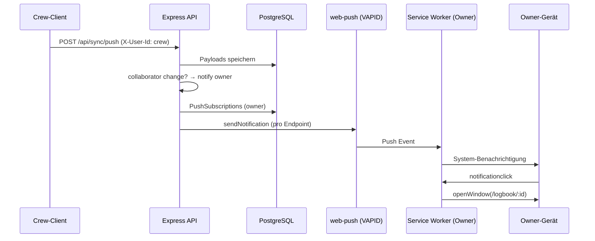

# Implementierungsplan: Push-Benachrichtigungen für Logbuch-Owner

**Ziel:** Der Owner eines Logbuchs soll per Web Push informiert werden, wenn ein eingeladenes Crewmitglied (Collaborator mit WRITE) Änderungen synchronisiert — auch wenn die App geschlossen ist.

**Stand Codebase:** Service Worker nur für PWA-Caching/Updates (`vite-plugin-pwa`). Sync läuft per `setInterval` im Tab (~30 s). Kein `web-push`, keine Push-Subscriptions in der DB.

---

## 1. Anforderungen

### Funktional (MVP)

| ID | Anforderung |
|----|-------------|
| N-01 | Owner kann Push-Benachrichtigungen global aktivieren/deaktivieren (Opt-in). |
| N-02 | Bei erfolgreichem Sync-Push durch einen **Nicht-Owner-Collaborator** erhält der Owner **eine** zusammengefasste Benachrichtigung pro Logbuch und Request (nicht pro Queue-Item). |
| N-03 | Klick auf die Benachrichtigung öffnet die App auf dem betroffenen Logbuch (Deep-Link `/logbook/:id` o. ä.). |
| N-04 | Benachrichtigungstext ist **generisch** (Zero-Knowledge: Server kann Titel/Inhalt nicht lesen). |
| N-05 | DE/EN über i18n-Keys; Sprache aus Browser/`Accept-Language` oder gespeicherter App-Sprache in Subscription-Metadaten. |
| N-06 | Abgelaufene/ungültige Subscriptions werden beim Fehlerversand gelöscht (410 Gone). |

### Nicht im MVP (später)

- Push an Collaborators bei Owner-Änderungen (bidirektional).
- Pro-Logbuch Ein/Aus (nur global reicht zunächst).
- Inhaltliche Details („Eintrag #3 bearbeitet“) — würde Klartext auf dem Server erfordern.
- E-Mail/SMS als Fallback.
- „Quiet hours“ / Do-not-disturb-Zeiten.

### Akzeptanzkriterien (UAT)

1. Owner aktiviert Push in den Einstellungen → Browser fragt Berechtigung → Subscription liegt in DB.
2. Collaborator bearbeitet Eintrag, App des Collaborators synct → Owner erhält Push innerhalb weniger Sekunden (Gerät online, Berechtigung erteilt).
3. Owner mit deaktivierten Push-Einstellungen erhält nichts.
4. Bulk-Sync (10 Items) → genau **eine** Push-Nachricht.
5. Klick öffnet installierte PWA oder Browser-Tab mit korrektem Logbuch.

---

## 2. Architektur



### Komponenten

| Schicht | Neu/Geändert | Aufgabe |
|---------|--------------|---------|
| **Prisma** | Neu | `PushSubscription`, optional `UserNotificationPrefs` |
| **Server** | Neu | `routes/push.ts`, `services/pushNotify.ts`, Env VAPID |
| **sync.ts** | Änderung | Nach erfolgreichem Collaborator-Push Owner benachrichtigen |
| **Client SW** | Neu | Custom SW (`injectManifest`) mit `push` + `notificationclick` |
| **Client UI** | Neu | Einstellungen: Toggle, Permission-Flow, Status |
| **Client Service** | Neu | `pushNotifications.ts` — subscribe, unsubscribe, sync mit API |

---

## 3. Plattform- und Produkt-Hinweise

| Thema | Auswirkung |
|-------|------------|
| **iOS** | Web Push für installierte PWAs ab **iOS 16.4+**. Nutzer müssen App zum Home Screen hinzufügen und Push erlauben. |
| **Android / Desktop** | Chrome/Edge/Firefox: gut unterstützt; PWA installiert empfohlen. |
| **HTTPS** | Web Push nur über HTTPS (Produktion erfüllt das). |
| **Zero-Knowledge** | Text z. B. „Neue Änderung in einem Ihrer Logbücher“ + `logbookId` nur im `data`-Payload (nicht im sichtbaren Titel nötig). |
| **Datenschutz** | Push-Endpoints sind personenbezogen → in Datenschutzerklärung erwähnen; Löschung bei Account-Löschung (Cascade). |

---

## 4. Datenmodell (Prisma)

```prisma
model PushSubscription {
  id        String   @id @default(uuid())
  userId    String
  endpoint  String   @unique
  p256dh    String   // keys.p256dh (base64url)
  auth      String   // keys.auth (base64url)
  userAgent String?  // optional, Debugging
  locale    String?  // "de" | "en" — für Notification-Text
  createdAt DateTime @default(now())
  updatedAt DateTime @updatedAt

  user User @relation(fields: [userId], references: [id], onDelete: Cascade)

  @@index([userId])
}

model UserNotificationPrefs {
  userId                    String  @id
  collaboratorChangesEnabled Boolean @default(false)
  updatedAt                 DateTime @updatedAt

  user User @relation(fields: [userId], references: [id], onDelete: Cascade)
}
```

`User`-Relationen ergänzen: `pushSubscriptions`, `notificationPrefs`.

**Migration:** `npx prisma migrate dev --name add_push_subscriptions`

---

## 5. Server-Implementierung

### 5.1 Abhängigkeit & Umgebung

```bash
npm install web-push --workspace=server
```

`.env` (Beispiel):

```env
VAPID_PUBLIC_KEY=...
VAPID_PRIVATE_KEY=...
VAPID_SUBJECT=mailto:support@kapteins-daagbok.eu
```

Keys einmalig erzeugen:

```bash
npx web-push generate-vapid-keys
```

Öffentlichen Key zusätzlich als `VITE_VAPID_PUBLIC_KEY` für den Client (nur Public Key).

### 5.2 API-Routen (`/api/push`)

| Methode | Pfad | Auth | Beschreibung |
|---------|------|------|--------------|
| `GET` | `/vapid-public-key` | nein | Liefert Public Key für `pushManager.subscribe` |
| `PUT` | `/subscription` | `X-User-Id` | Upsert Subscription (endpoint + keys) |
| `DELETE` | `/subscription` | `X-User-Id` | Body: `{ endpoint }` — Gerät abmelden |
| `GET` | `/prefs` | `X-User-Id` | Liest `collaboratorChangesEnabled` |
| `PUT` | `/prefs` | `X-User-Id` | Body: `{ collaboratorChangesEnabled: boolean }` |

`requireUser`-Middleware wie in `sync.ts` / `collaboration.ts` wiederverwenden.

### 5.3 Benachrichtigungs-Service

**Datei:** `server/src/services/pushNotify.ts`

```ts
// Pseudocode — Kernlogik
export async function notifyOwnerOfCollaboratorChanges(
  logbookId: string,
  ownerUserId: string,
  actorUserId: string,
  changeCount: number
): Promise<void>
```

Ablauf:

1. `UserNotificationPrefs`: wenn `collaboratorChangesEnabled !== true` → return.
2. Alle `PushSubscription` für `ownerUserId` laden.
3. Payload (Web Push JSON):

```json
{
  "title": "Kapteins Daagbok",
  "body": "Neue Änderung in einem Ihrer Logbücher.",
  "tag": "logbook-change-{logbookId}",
  "renotify": false,
  "data": { "url": "/logbook/{logbookId}", "logbookId": "{logbookId}", "changeCount": 3 }
}
```

4. `webpush.sendNotification(subscription, payload, options)` parallel mit `Promise.allSettled`.
5. Bei Status **410** oder **404**: Subscription aus DB löschen.
6. Fehler loggen, Sync-Response **nicht** fehlschlagen lassen (Push ist Best-Effort).

**Deduplizierung / Rate-Limit (empfohlen):**

- In-Memory-Map `ownerId:logbookId → lastSentAt` mit TTL 2–5 Minuten, **oder**
- Redis/DB-Tabelle `NotificationThrottle` mit `lastSentAt`.

Verhindert Push-Spam bei großen Offline-Queues.

### 5.4 Hook in `sync.ts`

Nach der Schleife über `items` (oder innerhalb, mit Sammellogik):

```ts
// Pro Request sammeln:
const ownerNotifications = new Map<string, { logbookId: string; count: number }>()

// Bei jedem erfolgreichen Item:
if (res.status === 'success' && !isOwner && isCollaborator) {
  if (action === 'create' || action === 'update') {
    const ownerId = logbook.userId
    const key = `${ownerId}:${logbookId}`
    const prev = ownerNotifications.get(key) ?? { logbookId, count: 0 }
    prev.count++
    ownerNotifications.set(key, prev)
  }
}

// Nach der Schleife, async fire-and-forget:
for (const [key, { logbookId, count }] of ownerNotifications) {
  const ownerId = key.split(':')[0]
  void notifyOwnerOfCollaboratorChanges(logbookId, ownerId, req.userId, count)
}
```

**Wichtig:** Owner, der selbst als „Crew“ irrtümlich synct, ist `isOwner` — kein Push.

**Optional später:** auch `delete`-Aktionen einbeziehen (gleiche Logik).

### 5.5 `index.ts`

```ts
import pushRouter from './routes/push.js'
app.use('/api/push', pushRouter)
```

---

## 6. Client-Implementierung

### 6.1 Service Worker (Custom `injectManifest`)

`vite.config.ts` anpassen:

```ts
VitePWA({
  strategies: 'injectManifest',
  srcDir: 'src',
  filename: 'sw.ts',
  injectRegister: 'auto',
  // manifest unverändert
})
```

**Datei:** `client/src/sw.ts`

- `precacheAndRoute` von Workbox importieren (wie vite-plugin-pwa-Doku).
- `self.addEventListener('push', …)`:
  - `event.data.json()` parsen
  - `self.registration.showNotification(title, { body, tag, data, icon: '/logo.png' })`
- `notificationclick`:
  - `event.notification.close()`
  - `clients.openWindow(data.url || '/')` — absolute URL mit `self.location.origin`

**i18n im SW:** MVP mit serverseitigem `locale` in Subscription; alternativ nur EN/DE-Body vom Server senden.

### 6.2 Client-Service `pushNotifications.ts`

| Funktion | Beschreibung |
|----------|--------------|
| `isPushSupported()` | `'serviceWorker' in navigator && 'PushManager' in window` |
| `getPermissionState()` | `Notification.permission` |
| `subscribeToPush()` | SW ready → `pushManager.subscribe({ userVisibleOnly: true, applicationServerKey })` → `PUT /api/push/subscription` |
| `unsubscribeFromPush()` | `subscription.unsubscribe()` + `DELETE` API |
| `syncPrefs(enabled)` | `PUT /api/push/prefs` |
| `ensureSubscriptionOnLogin()` | Wenn Prefs an und Permission granted, Subscription erneuern (Key-Rotation) |

`applicationServerKey`: VAPID Public Key von `GET /api/push/vapid-public-key` oder Build-Time `import.meta.env.VITE_VAPID_PUBLIC_KEY`.

### 6.3 UI (Settings)

**Ort:** `SettingsForm.tsx` (nur für Owner sichtbar, nicht bei `readOnly` / Crew-Logbuch).

Ablauf beim Einschalten:

1. `Notification.requestPermission()` — bei `denied` Hinweis + Link zu Browser-Einstellungen.
2. `subscribeToPush()` + `syncPrefs(true)`.
3. Bei Erfolg: grüner Status „Push aktiv“.

Beim Ausschalten:

1. `syncPrefs(false)` + optional `unsubscribeFromPush()` auf diesem Gerät.

**Hinweis-Banner** wenn `!isPushSupported()` oder iOS & nicht installiert → Verweis auf `PwaInstallPrompt`.

### 6.4 Deep-Link beim Öffnen

In `App.tsx` oder Router: beim Start `url` aus `notificationclick` via `clients.matchAll` nicht nötig — SW öffnet direkt.

Sicherstellen, dass Route `/logbook/:logbookId` (oder bestehende Logbuch-Route) existiert und Auth-Gate passiert.

### 6.5 Bestehenden SW-Update-Flow

`usePwaUpdate.ts` bleibt kompatibel mit `injectManifest`, sofern `virtual:pwa-register` weiter registriert wird — vite-plugin-pwa-Doku für `injectManifest` + React beachten.

---

## 7. Sicherheit

| Risiko | Maßnahme |
|--------|----------|
| Fremde subscriben mit fremder `userId` | Nur authentifizierte Requests (`X-User-Id` wie heute — langfristig Session/JWT erwägen). |
| Push an falschen User | `notifyOwner` nur mit `logbook.userId` aus DB, nie aus Client-Body. |
| Endpoint-Injection | `endpoint` muss HTTPS-URL sein; Länge begrenzen. |
| Spam durch Crew | Rate-Limit + nur `create`/`update` im MVP. |
| VAPID Private Key | Nur Server-Env, nie im Client. |

---

## 8. Implementierungsphasen

### Phase 1 — Infrastruktur (1–2 Tage)

- [ ] VAPID-Keys für Dev/Prod
- [ ] Prisma-Modelle + Migration
- [ ] `web-push` + `pushNotify.ts` + Unit-Test mit Mock-Subscription
- [ ] Routen `/api/push/*`
- [ ] `GET /vapid-public-key`

### Phase 2 — Service Worker (1 Tag)

- [ ] Umstellung auf `injectManifest` + `sw.ts`
- [ ] `push` / `notificationclick` Handler
- [ ] Manueller Test: `web-push` CLI oder kleines Admin-Skript sendet Test-Push

### Phase 3 — Trigger & Client-Anbindung (1–2 Tage)

- [ ] Hook in `sync.ts` mit Aggregation
- [ ] `pushNotifications.ts`
- [ ] Settings-UI + i18n (`de.json` / `en.json`)
- [ ] Plausible-Event optional: `push_enabled`, `push_denied`

### Phase 4 — Härtung (1 Tag)

- [ ] Rate-Limit / `tag`-basierte Ersetzung gleicher Logbuch-Pushes
- [ ] 410-Cleanup
- [ ] README + Datenschutz-Hinweis
- [ ] E2E-Manual-Testmatrix (iOS PWA, Android Chrome, Desktop)

### Phase 5 — Deployment

- [ ] Env-Variablen in Produktion (Docker/Hosting)
- [ ] Nginx: `sw.js` weiterhin `no-cache` (bereits in `nginx.conf`)
- [ ] Smoke-Test nach Deploy

**Geschätzter Gesamtaufwand:** 4–6 Entwicklertage für MVP.

---

## 9. Testplan

| # | Szenario | Erwartung |
|---|----------|-----------|
| T1 | Push nicht unterstützt (alter Browser) | UI zeigt „nicht verfügbar“, kein Fehler |
| T2 | Permission denied | Toggle aus, erklärender Hinweis |
| T3 | Owner aktiviert, Crew synct 1 Eintrag | 1 Push |
| T4 | Crew synct 5 Einträge in einem Request | 1 Push |
| T5 | Owner Prefs aus | Kein Push |
| T6 | Ungültige Subscription | 410 → DB-Eintrag weg, nächster Push an andere Geräte ok |
| T7 | notificationclick | App öffnet richtiges Logbuch |
| T8 | Owner ändert selbst | Kein Push an sich selbst |

**Dev-Test ohne zweites Gerät:** Zwei Browser-Profile (Owner + Crew), Crew-Einladung wie in Produktion.

---

## 10. Offene Entscheidungen (vor Start klären)

1. **Nur Owner oder auch andere Collaborators?** — MVP: nur Owner.
2. **Rate-Limit-Dauer:** 2 min vs. 5 min — Empfehlung: **3 min** pro Logbuch.
3. **Mehrere Geräte des Owners:** alle Subscriptions benachrichtigen — ja (Standard).
4. **Auth verbessern:** Push-Routen jetzt mit `X-User-Id` wie Rest der API; Roadmap-Item: echte Session.

---

## 11. Referenzen

- [web-push (npm)](https://www.npmjs.com/package/web-push)
- [MDN: Push API](https://developer.mozilla.org/en-US/docs/Web/API/Push_API)
- [vite-plugin-pwa: injectManifest](https://vite-pwa-org.netlify.app/guide/inject-manifest.html)
- [Apple: Web Push for PWAs (iOS 16.4+)](https://webkit.org/blog/13878/web-push-for-web-apps-on-ios-and-ipados/)

---

## 12. Datei-Checkliste (neu/geändert)

```
server/
  prisma/schema.prisma          # PushSubscription, UserNotificationPrefs
  prisma/migrations/.../
  src/routes/push.ts            # neu
  src/services/pushNotify.ts    # neu
  src/routes/sync.ts            # Hook notifyOwner
  src/index.ts                  # Router mount
  package.json                  # web-push

client/
  src/sw.ts                     # neu (injectManifest)
  vite.config.ts                # strategies: injectManifest
  src/services/pushNotifications.ts  # neu
  src/components/PushNotificationSettings.tsx  # neu (optional)
  src/components/SettingsForm.tsx    # Integration
  src/i18n/locales/de.json, en.json
  .env.example                  # VITE_VAPID_PUBLIC_KEY

docs/
  push-notifications-plan.md    # dieses Dokument
README.md                       # Feature-Zeile + Env-Hinweis
```
